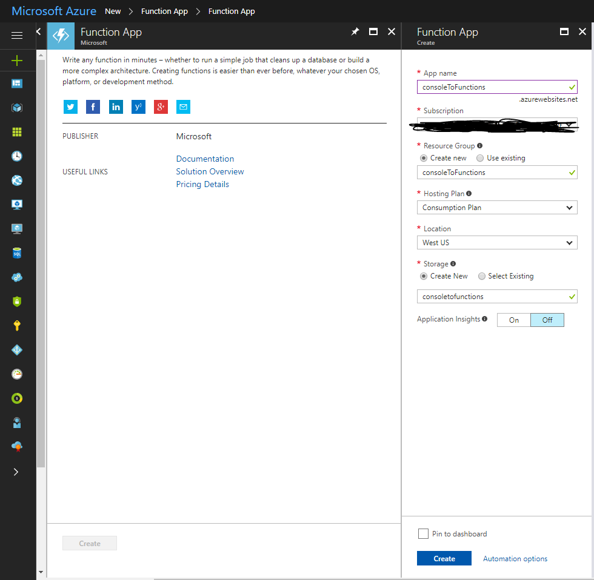
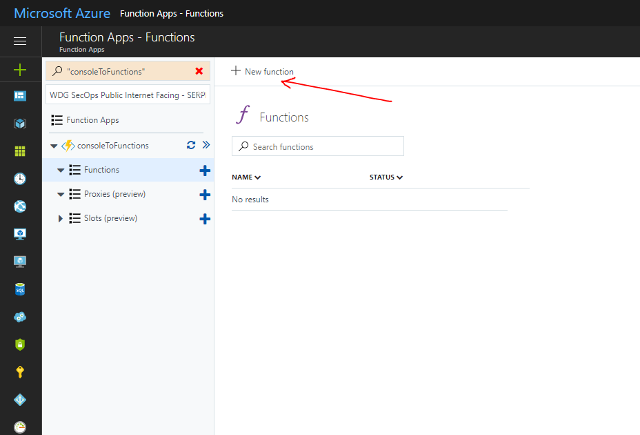
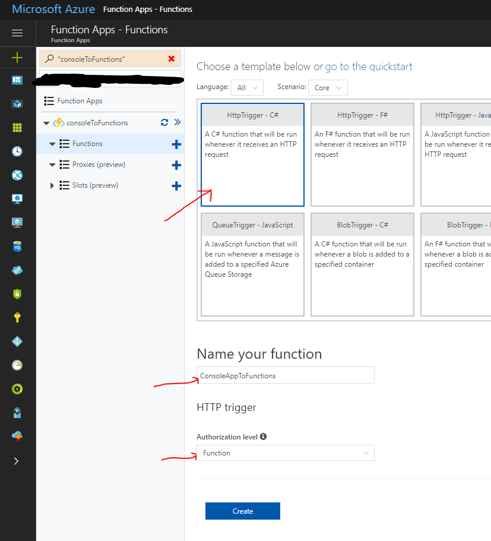
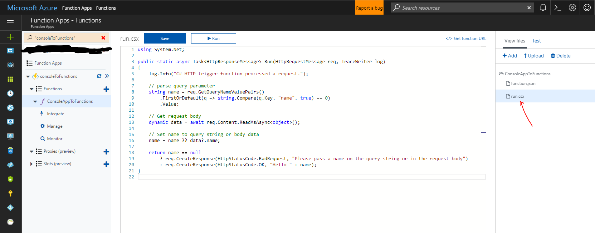
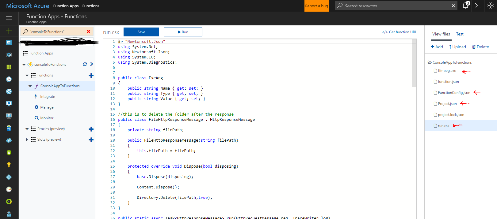

# Introduction 
Azure functions is a new offering from Microsoft that allows you to create serverless "compute on demand" applications. In this blog we provide a generic function that can be used to convert **any console application** to a HTTP **webservice**.

# Getting Started - Creating a new Function App
1. Login to - [Azure Portal](https://portal.azure.com)
2. Create a function app by specifying an App Name and storage account

 

3. Go to the function code editor and Create a New Function

 

4. Select **HTTPTrigger - C#** and name your function **ConsoleAppToFunction** with the right **Authorization Level**

 

# Adding Code

1. Select the run.csx file under **View files**



Add the following code to **Run.csx**
```csharp
#r "Newtonsoft.Json"
using System.Net;
using Newtonsoft.Json;
using System.IO;
using System.Diagnostics;


public class ExeArg
{
    public string Name { get; set; }
    public string Type { get; set; }
    public string Value { get; set; }
}

//this is to delete the folder after the response
public class FileHttpResponseMessage : HttpResponseMessage
{
    private string filePath;

    public FileHttpResponseMessage(string filePath)
    {
        this.filePath = filePath;
    }

    protected override void Dispose(bool disposing)
    {
        base.Dispose(disposing);

        Content.Dispose();

        Directory.Delete(filePath,true);
    }
}

public static async Task<HttpResponseMessage> Run(HttpRequestMessage req, TraceWriter log)
{
    log.Info("C# HTTP trigger function processed a request.");

   
    string localPath = req.RequestUri.LocalPath;
    string functionName = localPath.Substring(localPath.LastIndexOf('/')+1);

    var json = File.ReadAllText(string.Format(@"D:\home\site\wwwroot\{0}\FunctionConfig.json",functionName));

    var config = JsonConvert.DeserializeObject<dynamic>(json);

    var functionArguments = config.input.arguments;
    var localOutputFolder = Path.Combine(@"d:\home\data", config.output.folder.Value, Path.GetFileNameWithoutExtension(Path.GetTempFileName()));
    var workingDirectory = Path.Combine(@"D:\home\site\wwwroot", config.name.Value);
    Directory.SetCurrentDirectory(workingDirectory);

    var command = config.input.command.Value;

    string outputFile = config.output.binaryFile.returnFile.Value;
    string outputFileName = config.output.binaryFile.returnFileName.Value;

    var argList = new List<ExeArg>();

    //handle file system, local file etc. and construct the input params for the actual calling of the .exe
    foreach (var arg in functionArguments)
    {
        var exeArg = new ExeArg();
        exeArg.Name = arg.Name;
        var value = (Newtonsoft.Json.Linq.JObject)arg.Value;
        var property = (Newtonsoft.Json.Linq.JProperty)value.First;
        exeArg.Type = property.Name;
        exeArg.Value = property.Value.ToString();

        var valueFromQueryString = getValueFromQuery(req, exeArg.Name);

        log.Info("valueFromQueryString name=" + exeArg.Name);
        log.Info("valueFromQueryString val=" + valueFromQueryString);
        if(!string.IsNullOrEmpty(valueFromQueryString))
        {
            exeArg.Value = valueFromQueryString;
            log.Info(exeArg.Name + " " + valueFromQueryString);
        }
        

        if(exeArg.Type.ToLower() == "localfile" || exeArg.Type.ToLower() == "localfolder")
        {
            exeArg.Value = Path.Combine(localOutputFolder, exeArg.Value);
            exeArg.Type = "string";
        }
        if(string.IsNullOrEmpty(exeArg.Value))
        {
            //throw exception here
        }
        argList.Add(exeArg);
    }
    int i = 0;

    //call the exe
    Dictionary<string, string> paramList = ProcessParameters(argList, localOutputFolder);
    foreach (string parameter in paramList.Keys)
    {
        command = command.Replace(parameter, paramList[parameter]);
    }
    string commandName = command.Split(' ')[0];
    string arguments = command.Split(new char[] { ' ' }, 2)[1];
    Process.Start(commandName, arguments).WaitForExit();


    //handle return file
    var path = Directory.GetFiles(localOutputFolder, outputFile)[0];
    //HttpResponseMessage result = new HttpResponseMessage(HttpStatusCode.OK);
    var result = new FileHttpResponseMessage(localOutputFolder);
    var stream = new FileStream(path, FileMode.Open, FileAccess.Read);
    result.Content = new StreamContent(stream);
    result.Content.Headers.ContentType = new System.Net.Http.Headers.MediaTypeHeaderValue("application/octet-stream");
    result.Content.Headers.ContentDisposition = new System.Net.Http.Headers.ContentDispositionHeaderValue("attachment")
    {
        FileName = outputFileName
    };

    return result;
    //do clean up
}

private static Dictionary<string, string> ProcessParameters(List<ExeArg> arguments, string outputFolder)
{
    Dictionary<string, string> paramList = new Dictionary<string, string>();
    foreach (var arg in arguments)
    {
        switch (arg.Type)
        {
            case "url":
                string downloadedFileName = ProcessUrlType((string)arg.Value, outputFolder);
                paramList.Add("{" + arg.Name + "}", downloadedFileName);
                break;
            case "string":
                paramList.Add("{" + arg.Name + "}", arg.Value.ToString());
                break;
            default:
                break;
        }
    }
    return paramList;
}

private static string ProcessUrlType(string url, string outputFolder)
{
    Directory.CreateDirectory(outputFolder);
    string downloadedFile = Path.Combine(outputFolder, Path.GetFileName(Path.GetTempFileName()));
    //for oneDrive links 
    HttpWebRequest webRequest = (HttpWebRequest)HttpWebRequest.Create(url);
    webRequest.AllowAutoRedirect = false;
    WebResponse webResp = webRequest.GetResponse();
    webRequest = (HttpWebRequest)HttpWebRequest.Create(webResp.Headers["Location"].Replace("redir", "download"));
    webResp = webRequest.GetResponse();
    string fileUrl = webResp.Headers["Content-Location"];

    WebClient webClient = new WebClient();
    webClient.DownloadFile(fileUrl, downloadedFile);
    return downloadedFile;
}

private static string getValueFromQuery(HttpRequestMessage req, string name)
{
    // parse query parameter
    string value = req.GetQueryNameValuePairs()
        .FirstOrDefault(q => string.Compare(q.Key, name, true) == 0)
        .Value;
    return value;
}
```
Since the code uses Json.Net, create a Project.Json file with the following content

```json
{
  "frameworks": { 
    "net46":{ 
      "dependencies": { 
        "Newtonsoft.Json": "8.0.3" 
      } 
    } 
   }
}
```
This is a generic function that can now run any console application. The configuration of which console app to run is specified in a new **FunctionConfig.json** in the following example config we specify the function to run **FFMpeg.exe**
```json
{
  "name": "consoleAppToFunctions",
  "input": {
    "command": "ffmpeg.exe -i {inputFile} {output1}",
    "arguments": {
      "inputFile": {
        "url": "https://1drv.ms/v/<link-to-file>"
      },
      "output1": {
        "localfile": "out.mp3"
      }
    }
  },
  "output": {
    "folder": "outputFolder",
    "binaryFile": {
      "returnFile": "*.mp3",
      "returnFileName": "yourFile.mp3"
    }
  }
}
```
We needed a way to pass input files to our function. For this we define an **argument** of type **url**, where we expect the user to upload a file to **Onedrive** and provide the link in query string. 

Once these changes are done, the function should have the following files as shown below:



#Interacting with the function
1. Upload all input files to **OneDrive**
2. Get a link to the file using the OneDrive **Share** menu - something like https://1drv.ms/v/<link-to-file>
3. Interact with the function providing the inputs as querystring something like
```
https://consoletofunctions.azurewebsites.net/api/ConsoleAppToFunctions?code=<function-authorization-key>&inputFile=<link-to-onedrive-file>
```
The function will process this request by invoking the specified console app and provide the output as a file download.
